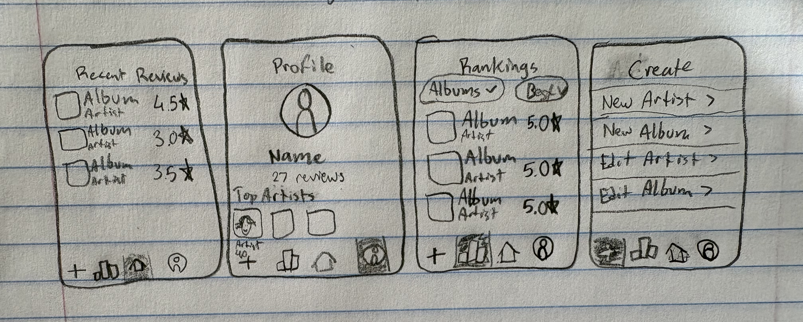

# MusicReviewer

Review your favorite artists' albums with the MusicReviewer app!
You can add artists, review albums, and see your collection of reviews in a variety of ways. 
Use the 'create' tab to get started (the "+" icon in the bottom left). Once you have an artist and/or a review, your collection has started! 

## Wireframe Sketch
#Project-2-SE3020-MusicReviewer

## Human-Interface Guidelines

From Apple's HIG, I have contemplated implememnting a couple of their recommendations. First, we have the icons section. Originally, the tab icons at the bottom had text underneath conveying the same message (under the home icon it said "home"). The text has been removed to follow Apple's recommendations, which has made for a cleaner look. Additionally, the profile icon has been updated from a person silhouette inside of a circle to just the person silhouette. This made the icons look more uniform.

Secondly, I reviewed their piece about theming (dark/light modes). It is recommended that if you do not need to do anything special with your app's color scheme to keep it to the system settings. I decided to make a seasonal theme (which would be updated periodically if the app were distributed), so I will be using custom themes. It is not necessary for the functionality or brand of the app, so this is technically against the HIG.

Finally, the HIG has recommendations about showing Alerts. It suggests using alerts as sparingly as possible, as people do not appreciate being interrupted. It says to "avoid displaying alerts for common, undoable actions, even when they're destructive." Which is exactly something that I am doing, so I am once again defying the HIG. Give how close the 'delete' button on my screens is to the 'save' button and how close it is to the bottom of the screen -- meaning it is succeptible to being accidentally pressed -- I prefer to use an alert for confirmation. I would hate if I spent time writing a thoughtful review only to have the phone slip in my hand and delete it all. This is a safeguard against it, though I recognize it may sacrifice some of the user experience.
# MusicReviewer